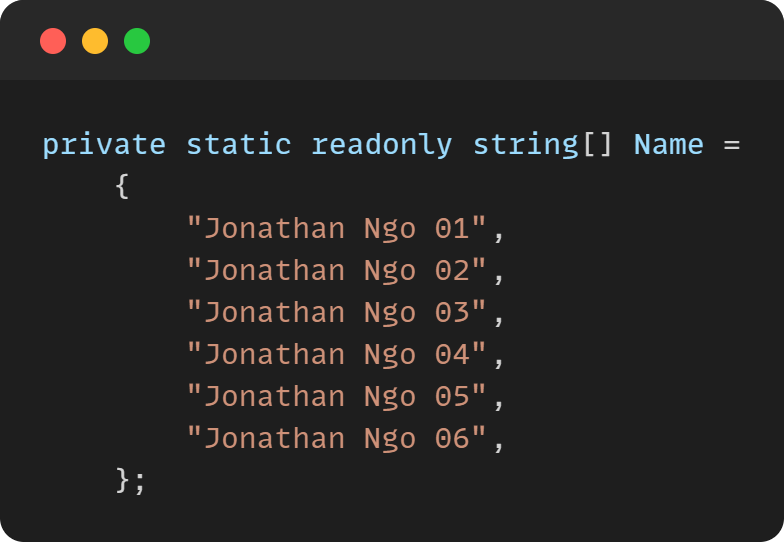
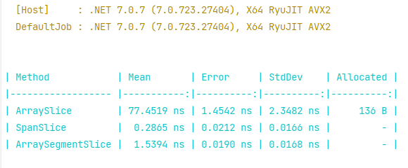
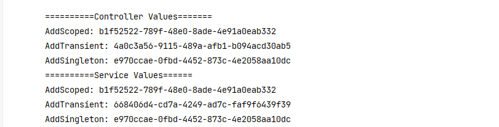
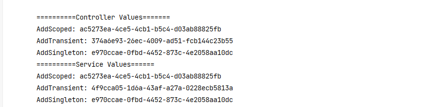

<!--  -->
Hi folks 👋 I am a full-stack website developer proficient in Angular and Asp.Net Core. I am passionate about problem-solving and using effective modeling to create well-designed systems. Additionally, I enjoy playing and developing video games. Nice to meet you!

### Touch me on Linkedin: [JonathanNgo](https://www.linkedin.com/in/jonathan-ngo148/?fbclid=IwAR0ddBOeNEedryN5kAXRTA-DLGcjdwPaX1CBEqdCDvkjw81RQLxCrXBnyrc)
<!--
**trongngo148/trongngo148** is a ✨ _special_ ✨ repository because its `README.md` (this file) appears on your GitHub profile.

Here are some ideas to get you started:

- 🔭 I’m currently working on ...
- 🌱 I’m currently learning ...
- 👯 I’m looking to collaborate on ...
- 🤔 I’m looking for help with ...
- 💬 Ask me about ...
- 📫 How to reach me: ...
- 😄 Pronouns: ...
- ⚡ Fun fact: ...
-->

#Notes .NET
Here's what I've learned while applying .NET.

✅ : High recommend

### #1.The power of these types

Define an array: 

Define functions for performance testing: 

The result:

✨ Explanation:

**Array**: We need to allocate memory, so it will take up more memory.
✅ **Span**: We are using pre-allocated memory.
✅ **ArraySegment**: This is not an array; it is a struct wrapper for an array and internally uses pointers and offsets to provide a sort of view.

### #2. (DI) What is different between AddScoped, AddTransient and AddSingleton ?

First Request:

Second Request:

✨ Explanation: 

**Transient** objects are always different; a new instance is provided to every controller and every service.

**Scoped** objects are the same within a request, but different across different requests

**Singleton** objects are the same for every object and every request (regardless of whether an instance is provided in ConfigureServices)

======================
Other parts coming soon...